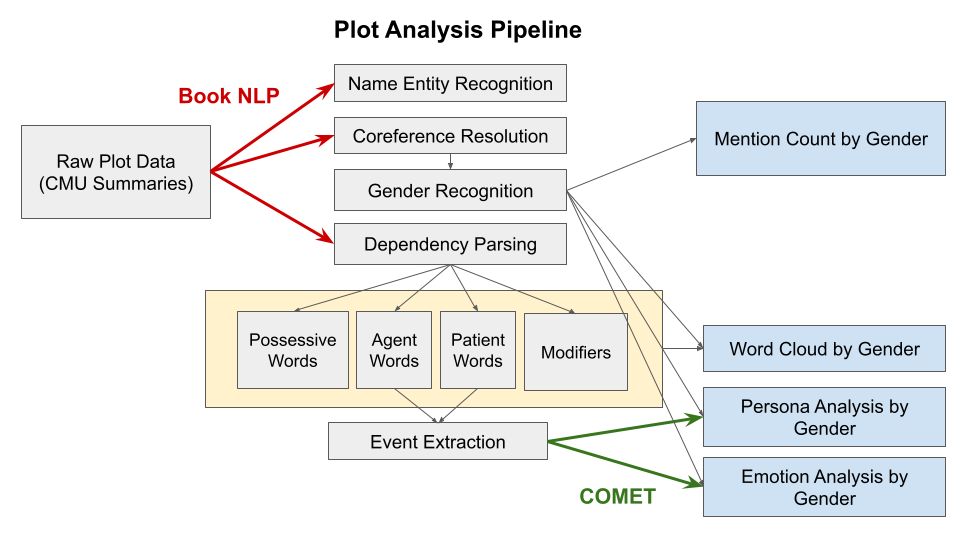

# Gender in the Film World

## Abstract

In this project we will explore the role of gender in the film industry. We have decided to investigate a variety of ideas and themes around gender. We will consider questions about gender in roles, directors, character portrayals, and general sentiment. 

We were inspired to choose this topic because gender representation in film provides a lot of insight into how the world/region portrays gender roles. With our data story, we will investigate the potential gender imbalances and stereotypes present in films over time. We will effectively show any disproportionly representation in film. We will show the possible character stereotypes that are damaging to our view of women. Also, we will look into the general sentiment associated with men and women characters. Exploring these topics will bring to light the potential misrepresentations and imbalances of gender in film. We feel that creating this story is important because of this.

## Research Questions

In this section we have listed the main research questions we would like to address during this project. 

- What are the gender imbalances in acting and production roles? And how have these imbalances changed over time?

- What are the stereotypical character types across gender? How are these characters portrayed? Have these stereotypes changed with time? 

- In general, are there different adjectives, actions, and personas that are given to men versus women characters? Are the words used in either case seen as positive or negative? Can we assess the sentiment around different gendered roles?

- Is genders' imbalanced representation in movies corrrelated with succesful or unsuccesful films?

- Does the gender of the director affect the representation of males or females in movies?

In addition to these main questions, we may choose to explore other sub-questions. As we have gone through the dataset in our initial analysis, we have stumbled upon other interesting gender-related topics. For example, we may look into how movie ratings differ for movies with female leads versus male leads. 

## Supplementary Data

In addition to the CMU dataset, we are using the Wikipedia pages that exist for a subset of the CMU dataset movies. With these Wikipedia pages, we have accessed the plot summaries. The plot summaries will potentially supplement the smaller summaries in the CMU dataset. For our analysis, the plot summaries are being used to extract information and sentiment about the different characters. To access the Wikipedia data, we are simply requesting webpages based on the 'wiki_movie_id' key in the CMU dataset from the Wikipedia API.  

We are also planning on using data from IMBD. We will access movies' scores and the directors. We want this data for two main reasons: to study the relationship between a lead role's gender and the respective movie's IMBD rating and to study the potential gender imbalances in movie production jobs. We will study how both of these have changed with time. To access this data, we used the IMBD id which is commonly found in the Wikipedia pages. Since IMBD's API has licensing restrictions, it is not so straightforward to access the data. Instead we are going to use IMBD's provided non-commercial datasets.  

## Methods
### Plot Analysis

For our plot analysis, we used [the Book NLP library](https://github.com/booknlp/booknlp) to perform Named Entity Recognition (NER), coreference resolution, and dependency parsing. Book NLP, specifically designed for literary texts, was chosen as it is well-suited for analyzing narrative structures like plots. We identified characters' genders through pronoun-based Gender Recognition and examined words associated with each character using dependency parsing.

Our analysis included:

- Counting the number and mention frequency of female and male characters in the plot ("Mention Count by Gender"), and
- Examining words associated with each gender in different roles, such as possessive words, agent words, patient words, and modifiers ("Word Cloud by Gender").

Moving beyond simple word associations, we extracted events related to agent and patient words, using the COMET model to infer potential character attributes (xAttribute) and emotions (xReact, oReact) based on these events. This allowed us to analyze variations in personas and emotional responses across genders.

### ML
Train a model to predict gender from metadata (e.g., role, genre, awards). Analyze feature importance to identify attributes strongly correlated with each gender.

### Clustering of genre success (revenue) by gender

Task: That you have a reasonable plan and ideas for methods you’re going to use, giving their essential mathematical details in the notebook.

## Project Timeline

## Team Milestones

---

### Deep5eekers Team

- Simon Anton
- Kyuhee Kim
- Christina Kopidaki
- Margarita Mikhelson
- Ivan Pavlov
