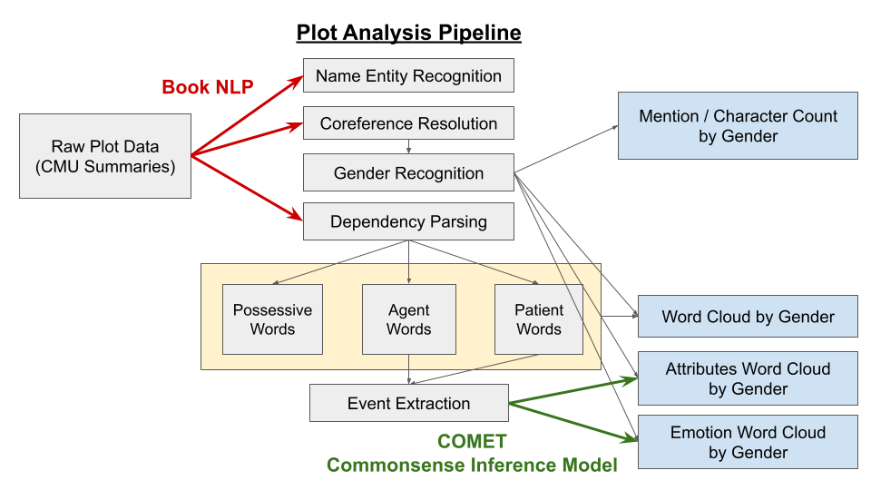

# Exploring Gender Dynamics in Film

## Abstract

In this project we will explore the role of gender in the film industry. We have decided to investigate a variety of ideas and themes around gender. We will consider questions about gender in roles, directors, character portrayals, and general sentiment. 

We were inspired to choose this topic because gender representation in film provides a lot of insight into how the world/region portrays gender roles. With our data story, we will investigate the potential gender imbalances and stereotypes present in films over time. We will effectively show any disproportionly representation in film. We will show the possible character stereotypes that are damaging to our view of women. Also, we will look into the general sentiment associated with men and women characters. Exploring these topics will bring to light the potential misrepresentations and imbalances of gender in film. We feel that creating this story is important because of this.

## Research Questions

In this section we have listed the main research questions we would like to address during this project. 

- RQ1: What gender imbalances exist in acting roles, and how do these differences vary over time, across genres, and between countries?
- RQ2: What stereotypical character types are associated with each gender?
- RQ3: In plot lines, are male and female characters typically assigned different actions and portrayals? Do the words used in each case convey positive or negative connotations?
- RQ4: Is unequal gender representation in films linked to a movie’s success or failure?
- RQ5: Does gender inequality exist in production roles as well? Does a director's gender influence the portrayal of male and female characters in films?

In addition to these main questions, we may choose to explore other sub-questions. As we have gone through the dataset in our initial analysis, we have stumbled upon other interesting gender-related topics. For example, we may look into how movie ratings differ for movies with female leads versus male leads. 

## Supplementary Data

- Wikipedia: In addition to the CMU dataset, we are using the Wikipedia pages that exist for a subset of the CMU dataset movies. We are going to use this Wikipedia pages for several purposes: retrieve plot summary information (it might be richer than provided in CMU), get IMDb id for the movies, retrieve general information about people (gender, occupation). To access the Wikipedia data, we are processing the latest wikipedia dump, using 'wiki_movie_id' key in the CMU dataset to retrieve the specific pages.  

- IMDb: We are also planning on using data from IMDb. We will access movies' scores, number of votes and the information about the people: directors, writers. We want this data for two main reasons: to study the relationship between a lead role's gender and the respective movie's IMDb rating and to study the potential gender imbalances in movie production jobs. To access this data, we used the IMDb ID which is commonly found in the Wikipedia pages. Since IMDb's API has licensing restrictions, it is not so straightforward to access the data. Instead, we are going to use IMDb's provided non-commercial datasets.  

- Oscar: We are planning to use data from the Oscar nomination to analyze gender inequality in the awards nomination. We will use public Oscar's search base and parse the provided html with award's history for our needs.  

## Methods

### Research Question 1: Gender Imbalances
The first step to starting off our analysis, was getting to know the data and the information we could gather based on that. 

- We wrote utility functions in order to load the datasets in convenient formats.
- Preliminary analysis was conducted to visualize the representation of male and female characters, across countries, years and genres. (RQ1) 
- We have used the clustering provided by the CMU datasets. Analysis of frequency of different personality traits by gender was performed. (RQ2)
- We have enriched our data with additional datasets, scrapping information from wikipedia, getting familiar with IMDb and Oscar datasets. Those datasets are merged using Wikipedia to IMDb id mapping. We still have to enrich the data, as currently no gender labels for production roles and Oscar dataset are present.  

### Research Question 2: Gender Stereotypes

### Research Question 3: Plot Analysis

To address our RQ3, we conducted a plot analysis using [the Book NLP library](https://github.com/booknlp/booknlp), performing Named Entity Recognition (NER), coreference resolution, and dependency parsing. Designed specifically for literary texts, Book NLP was chosen for its effectiveness in analyzing narrative structures. We identified characters' genders through pronoun-based Gender Recognition and analyzed words associated with each character using dependency parsing.

Our analysis included:

- Counting the number and frequency of mentions of female and male characters in the plot ("Mention Count by Gender"), and
- Examining words associated with each gender in various roles, such as possessive words, agents, patients, and modifiers ("Word Cloud by Gender").

Expanding beyond basic word associations, we extracted events involving agent and patient roles and will use [the COMET model along with the Kogito library](https://github.com/epfl-nlp/kogito) to infer likely character attributes (xAttribute) and emotions (xReact, oReact) based on these events (TBD). This approach will allow us to explore variations in personas and emotional responses across genders.

### Research Question 4: Representation & Success

### Research Question 5: Behind The Scenes 

## Project Timeline

### Week 1: Finalize P2 achievements
- Merge CMU, IMDb and Oscar data (Enrich collected data with Gender data for Actors, Directors, etc. using Wikipedia)
- More work on RQ1, RQ2, additional hypothesis testing
- In depth work on RQ3
### Week 2: Homework  
- Start working on RQ5
- ADA Homework 2 =) 
### Week 3: Oscar and Revenue
- Work on RQ4, evaluating box office and gender associations
- Analyze Oscar data, enhance analysis of the (RQ5) with more production roles from the Oscar data. 
### Week 4: Data Visualization
- Start working on the website
- Work on detailed/rich visualizations (matplotlib plots --> JS plots)
### Week 5: Final Presentation
- Write a story, project presentation
- Clean up visualization

### Deep5eekers Team

- Simon Anton (WebDevelopment expert)
- Kyuhee Kim (Plot Analysis expert, RQ3)
- Christina Kopidaki (Visualization expert, RQ1, RQ2)
- Margarita Mikhelson (Statistician, Hypothesis testing)
- Ivan Pavlov (Data Engineer, Enriching the data)
